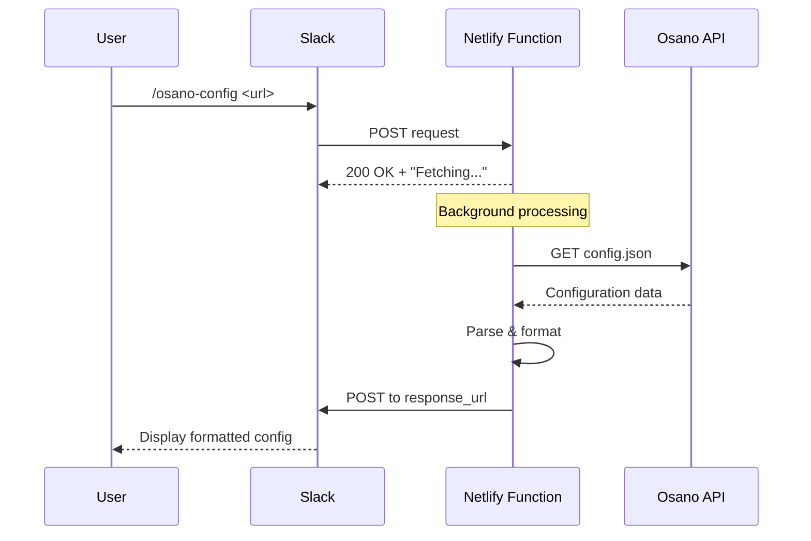

# Osano Config Details Bot

A Slack bot that fetches and displays Osano Consent Management Platform (CMP) configuration details in a human-readable format. Built as a Netlify serverless function.

## 🚀 Features

- **Instant Configuration Analysis**: Paste an Osano script URL and get a comprehensive configuration summary
- **Slack Integration**: Works seamlessly as a Slack slash command
- **Detailed Reporting**: Displays account details, compliance settings, frameworks, scripts, cookies, iFrames, and IAB vendors
- **Reliable Performance**: Asynchronous processing ensures responses always appear in the correct channel
- **Error Handling**: Clear, user-friendly error messages with timeout protection

## 📋 What It Reports

The bot provides detailed information about:

### Account & Compliance
- Account ID and Config ID
- Configured domains
- Compliance mode (Permissive/Strict/Discovery)

### Privacy Frameworks
- GPC (Global Privacy Control) support
- Do Not Track support
- IAB TCF (Transparency & Consent Framework)
- Google Consent Mode integration

### Banner Configuration
- Policy link text and URLs
- Additional links
- Banner timeout settings
- Drawer preferences

### Experience Settings
- Block list status
- First layer categories
- Manage preferences options
- US State banner format (CCPA)
- Cross-domain support

### Asset Classification
- **Scripts**: All classified scripts with their categories
- **Cookies**: Cookie details including provider, classification, and expiry
- **iFrames**: Classified iFrames and blocking mode
- **IAB Vendors**: Disclosed IAB vendor IDs

## 🛠️ Setup

### Prerequisites

- Node.js 14.x or higher
- A Netlify account
- A Slack workspace with admin permissions

### Installation

1. **Clone the repository**
   ```bash
   git clone https://github.com/cwashington449/config-details-bot.git
   cd config-details-bot
   ```

2. **Install dependencies**
   ```bash
   npm install
   ```

3. **Deploy to Netlify**
   
   Option A - Using Netlify CLI:
   ```bash
   npm install -g netlify-cli
   netlify login
   netlify deploy --prod
   ```
   
   Option B - Connect via Netlify Dashboard:
   - Push your code to GitHub
   - Connect your repository in Netlify
   - Netlify will auto-deploy on push

4. **Configure Slack Slash Command**
   
   a. Go to [Slack API Apps](https://api.slack.com/apps)
   
   b. Create a new app or select an existing one
   
   c. Navigate to "Slash Commands" and create a new command:
      - **Command**: `/osano-config` (or your preferred name)
      - **Request URL**: `https://your-netlify-site.netlify.app/.netlify/functions/osano-config`
      - **Short Description**: "Get Osano CMP configuration details"
      - **Usage Hint**: `[Osano script URL or tag]`
   
   d. Install the app to your workspace
   
   e. Test the command in any Slack channel

## 📖 Usage

### In Slack

Simply use the slash command with an Osano script URL:

```
/osano-config https://cmp.osano.com/CUSTOMER-ID/CONFIG-ID/osano.js
```

Or paste the entire script tag:

```
/osano-config <script src="https://cmp.osano.com/CUSTOMER-ID/CONFIG-ID/osano.js"></script>
```

The bot will:
1. Show an immediate "Fetching..." message
2. Retrieve the configuration from Osano
3. Update the message with a comprehensive summary

### Example Output

```
⏳ Fetching Osano configuration details...

*Account Details*
*Account ID:* abc123xyz
*Config ID:* def456uvw
*Domains:* example.com, www.example.com

*Compliance Mode*
*Mode:* Strict

*Banner Links*
*Link Text:* Privacy Policy
*Link URL:* https://example.com/privacy

*Frameworks*
*Support GPC:* True
*Support Do Not Track:* False
*IAB TCF:* True
*Google Consent Mode:* True

...
```

## 🏗️ Architecture



### Key Components

- **Asynchronous Processing**: Immediate acknowledgment prevents Slack's 3-second timeout
- **Background Execution**: Configuration fetching happens after responding to Slack
- **Delayed Response**: Results sent via `response_url` ensure correct channel delivery
- **Timeout Protection**: 25-second timeout prevents hanging requests

## 🔧 Development

### Local Testing

1. **Install Netlify CLI**
   ```bash
   npm install -g netlify-cli
   ```

2. **Run locally**
   ```bash
   netlify dev
   ```

3. **Test the function**
   ```bash
   curl -X POST http://localhost:8888/.netlify/functions/osano-config \
     -H "Content-Type: application/x-www-form-urlencoded" \
     -d "text=https://cmp.osano.com/CUSTOMER-ID/CONFIG-ID/osano.js&response_url=https://hooks.slack.com/commands/YOUR/WEBHOOK/URL"
   ```

### Project Structure

```
config-details-bot/
├── netlify/
│   └── functions/
│       └── osano-config.js    # Main serverless function
├── .gitignore
├── package.json
└── README.md
```

### Code Overview

**Main Functions:**

- `getValue(obj, path, defaultValue)` - Safely retrieves nested object values
- `formatValue(value, type)` - Formats values for display (booleans, modes, arrays)
- `generateConfigSummary(data)` - Generates the formatted Slack message
- `processRequest(text, response_url)` - Background processing of Osano config
- `exports.handler(event)` - Main Netlify function handler

## 🐛 Troubleshooting

### Bot doesn't respond
- Verify the Netlify function URL is correct in Slack settings
- Check Netlify function logs for errors
- Ensure the Osano URL format is correct

### Responses appear in wrong channel
- This was fixed in v2.0 - ensure you're using the latest version
- The bot now uses `response_url` for all responses

### Timeout errors
- The bot has a 25-second timeout for Osano API calls
- If Osano's API is slow, you'll receive a timeout message
- Try again or check Osano's service status

### Configuration not found
- Verify the Osano URL is accessible
- Check that the customer ID and config ID are correct
- Ensure the config.json endpoint is publicly accessible

## 📝 Dependencies

- **node-fetch** (^2.7.0) - HTTP client for fetching Osano configurations

## 🔐 Security

- No sensitive data is stored
- All requests are processed in real-time
- Osano configurations must be publicly accessible
- Slack webhook URLs are used only for response delivery

## 📄 License

MIT License - feel free to use and modify as needed.

## 🤝 Contributing

Contributions are welcome! Please feel free to submit a Pull Request.

1. Fork the repository
2. Create your feature branch (`git checkout -b feature/AmazingFeature`)
3. Commit your changes (`git commit -m 'Add some AmazingFeature'`)
4. Push to the branch (`git push origin feature/AmazingFeature`)
5. Open a Pull Request

## 📧 Support

For issues or questions:
- Open an issue on GitHub
- Check existing issues for solutions
- Review Netlify function logs for debugging

## 🎯 Roadmap

- [ ] Add support for multiple Osano configurations in one command
- [ ] Export configuration as JSON or CSV
- [ ] Add configuration comparison feature
- [ ] Support for private/authenticated Osano endpoints
- [ ] Interactive buttons for detailed sections

---

Made with ❤️ for easier Osano configuration management
